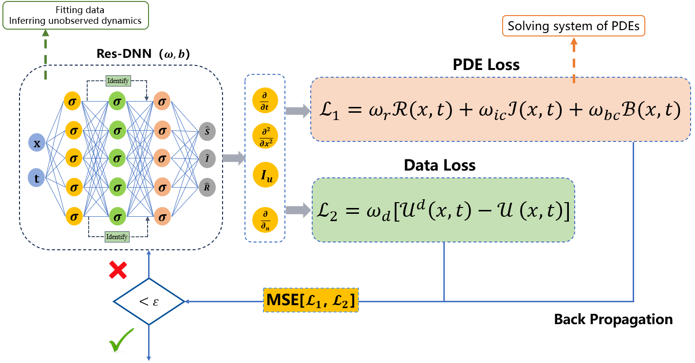
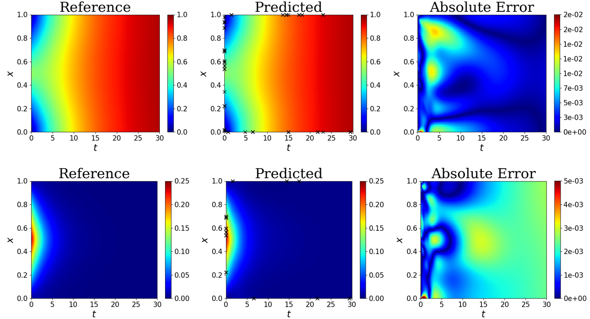
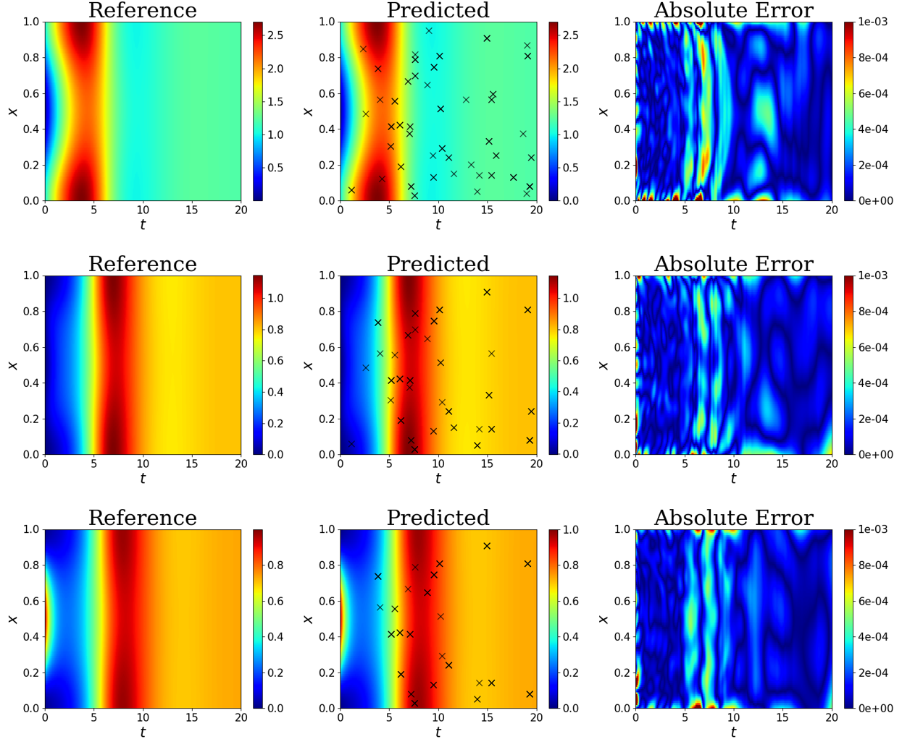
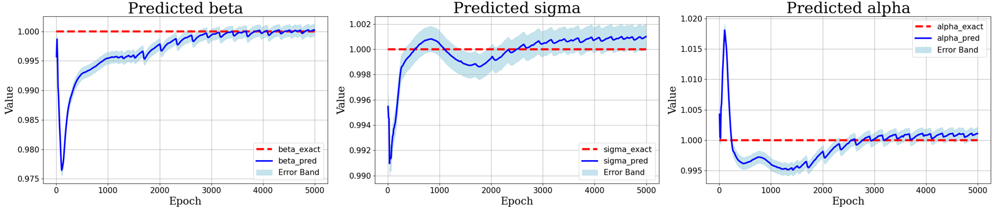

# RD-DINN
Physical information neural network for solving infectious disease problems with diffusion term




## Abstract
In this paper, we consider a partitioned epidemic model with  reaction diffusion behavior, analyzing the dynamics of populations in various compartments, and exploring the significance of spreading parameters. Unlike traditional approaches, we propose a novel paradigm for addressing the dynamics of epidemic models: inferring model dynamics and more importantly parameter inversion to analyze disease spread using Reaction-Diffusion Disease Information Neural Networks (RD-DINN). This method leverages the principles of hidden disease spread to overcome the black-box mechanism of neural networks relying on large datasets. Through an embedded deep neural network incorporating disease information, the RD-DINN approximates the dynamics of the model while predicting unknown parameters.To demonstrate the robustness of the RD-DINN method, we conduct an analysis based on two disease models with reaction-diffusion terms. Additionally, we systematically investigate the impact of the number of training points and noise data on the performance of the RD-DINN method. Our results indicate that the RD-DINN method exhibits relative errors less than $1\%$ in parameter inversion with $10\%$ noise data. In terms of dynamic predictions, the absolute error at any spatiotemporal point does not exceed $5\%$.In summary, we present a novel deep learning framework RD-DINN, which has been shown to be effective for reaction-diffusion disease modeling, providing an advanced computational tool for dynamic and parametric prediction of epidemic spread.

## Installation

First install the required dependencies by running the following commands:

```
pip3 install --upgrade -r requirements.txt
```

This code has been tested on the following environment:

```
matplotlib==3.2.1
scipy==1.10.1	
numpy==1.24.3
torch==2.4.1
torchvision==0.20.0
pyDOE
collections
```

Then install the `RD-DINN` package by running the following command:

```
git clone https://github.com/yuanfanglila/RD-DINN.git
cd RD-DINN
pip install -e .
```

## Experiments

### SIR

Let $x\in [0,L]$, the density distribution of the unknown compartments $S(x,t)$ and $I(x,t)$ in the spatiotemporal domain satisfies the partial differential equation system

$$
\begin{cases}
	\frac{\partial S}{\partial t}-d_1 \frac{\partial^2 S}{\partial x^2}=B-\beta S I-\mu S, & x\in [0,L], \quad t>0 \\
	\frac{\partial I}{\partial t}-d_2 \frac{\partial^2 I}{\partial x^2}=\beta S I-\alpha I-\mu I, & x\in [0,L],  \quad t>0 \\
	\partial_\eta S=\partial_\eta I=0, & x={0,L}, \quad t>0 \\
	S(x, 0)=S_0(x), I(x, 0)=I_0(x) & x\in [0,L]
\end{cases}
$$

subject to  the initial conditions

$$
\begin{array}
		S(x, 0)=S_0(x), & I(x, 0)=I_0(x)\\
\end{array}
$$
and Neumann boundary conditions

$$
\begin{array}
		\frac{\partial S}{\partial x}(0, t)=g^{(1)}_1(t), & 
		\frac{\partial I}{\partial x}(0, t)=g^{(2)}_1(t),\\
		\frac{\partial S}{\partial x}(L, t)=g^{(1)}_2(t), & 
		\frac{\partial I}{\partial x}(L, t)=g^{(2)}_2(t).
\end{array}
$$



### SEIR

$$
\begin{align*}
	&f(t,x):=\frac{\partial S(x, t)}{\partial t} - d_1 \frac{\partial^2 S}{\partial x^2} - B+\lambda_1 S(x, t) I(x, t)+\mu S(x, t),\\
	&g(t,x):=\frac{\partial E(x, t)}{\partial t} - d_2 \frac{\partial^2 E}{\partial x^2} - \lambda_1 S(x, t) I(x, t) + (\mu + \lambda_2) E(x, t),\\
	&h(t,x):=\frac{\partial I(x, t)}{\partial t} - d_3 \frac{\partial^2 I}{\partial x^2} - \lambda_2 E(x, t) + (\lambda_3 + \mu) I(x, t).
\end{align*}
$$






